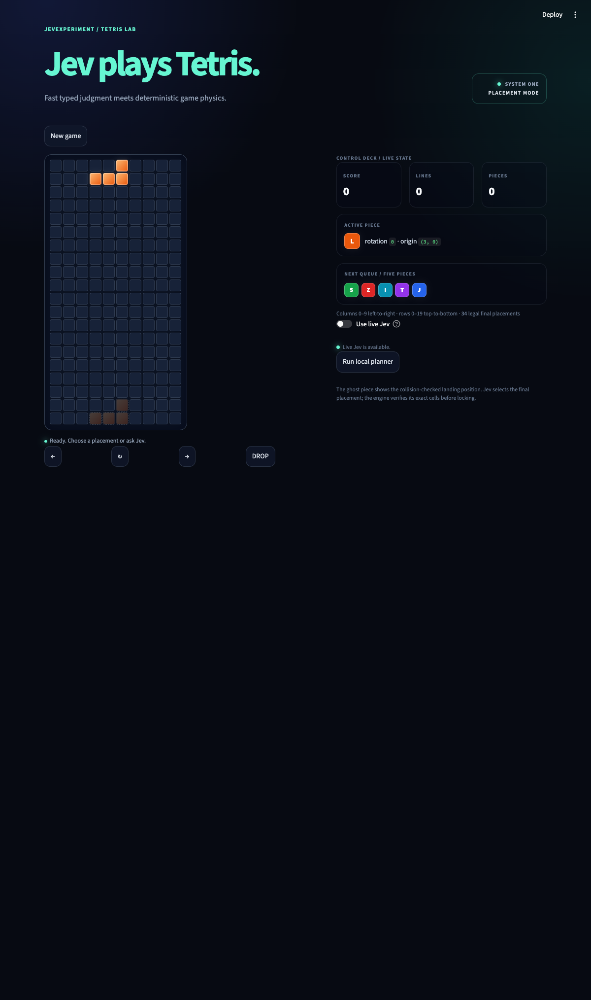
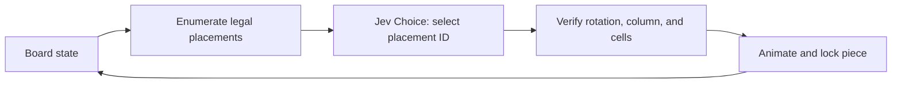

# Jev plays Tetris

> A small arcade game where Jev chooses a complete, collision-checked Tetris placement — and Python owns the physics.



This is a public, company-data-free TypeSafe experiment. It demonstrates a
useful pattern for Jev: give the model a finite set of valid outcomes, ask it
to select one typed option, and let ordinary code verify and execute the choice.

## Why this demo is interesting

Jev is not asked to invent keyboard commands or output arbitrary coordinates.
The engine enumerates the legal final placements for the current piece. Each
candidate contains:

- rotation (`0`, `R`, `2`, or `L`);
- leftmost occupied column and landing row;
- exact occupied cells as `[column, row]` pairs;
- lines cleared, holes, height, and surface bumpiness;
- a one-piece lookahead score.

Jev returns one placement ID, such as `p11`. The engine checks that the ID is
still legal and that its exact cells match before locking the piece.



## Features

- SRS-style rotations and wall/floor kicks;
- 7-bag piece generation;
- five-piece next queue;
- ghost landing preview;
- visible rotation, movement, drop, and lock animation;
- one-shot `Ask Jev for Placement` mode for inspecting a single decision;
- `Jev Playing Tetris` mode that keeps making verified placements until paused;
- local deterministic planner for testing without an API key;
- live Jev mode with confidence and alternative probabilities;
- inspectable request/response trace with a JSON export for every decision;
- exact placement verification before every lock;
- synthetic local state only — no company data.

## Run it locally

```sh
uv sync
uv run streamlit run app.py
```

Then open [http://localhost:8501](http://localhost:8501).

The local planner works without credentials. To enable live Jev, set the key in
the server environment before starting Streamlit:

```sh
export TYPESAFE_API_KEY="your-key"
uv run streamlit run app.py
```

The key is read by Python and is never sent to the browser. `.env.example`
documents the optional variable without containing a secret.

The control deck has two play modes. `Ask Jev for Placement` advances one piece
so you can inspect its rotation, column, landing row, and confidence. `Jev
Playing Tetris` repeats the same typed-choice, verify, animate, and lock loop one
piece at a time until you press `Pause Jev` or the board reaches game over.
Without an API key, both controls use the deterministic local planner so the full
interaction remains testable.

After a placement, use `View JSON input · state and question` and `View JSON
output · Jev response` to inspect the decision in collapsible panels. `Export
JSON trace` downloads the complete decision history for the current game,
including each selected placement, confidence, probabilities, and verified
result. Local-planner traces are labeled as previews and are not sent to Jev.

## Run the checks

```sh
uv run python -m unittest discover -s tests -v
uv run python -m py_compile app.py tetris_game.py courtroom.py database.py scenarios.py
```

## Coordinate contract

The board uses zero-based coordinates:

- columns: `0` through `9`, left to right;
- rows: `0` through `19`, top to bottom;
- candidate `column`: the leftmost occupied cell;
- candidate `occupied_cells`: the exact four cells after the piece lands.

This makes a Jev answer easy to inspect in a demo:

```text
Place T in rotation R at column 2, landing row 17.
Occupied cells: [[2, 17], [2, 18], [2, 19], [3, 18]].
```

## Project map

| File | Purpose |
| --- | --- |
| `app.py` | Streamlit entry point |
| `tetris_game.py` | Game engine, placement enumeration, Jev integration, and UI |
| `tests/test_tetris_game.py` | Physics and placement-contract tests |
| `assets/demo.png` | README preview image |
| `.env.example` | Optional live-Jev environment variable |

The earlier synthetic Agent Courtroom and SQLite experiment files remain in
the folder for comparison, but the default app is the Tetris playground.

## Built with

[TypeSafe](https://typesafe.ai/) · [Streamlit](https://streamlit.io/) · Python
